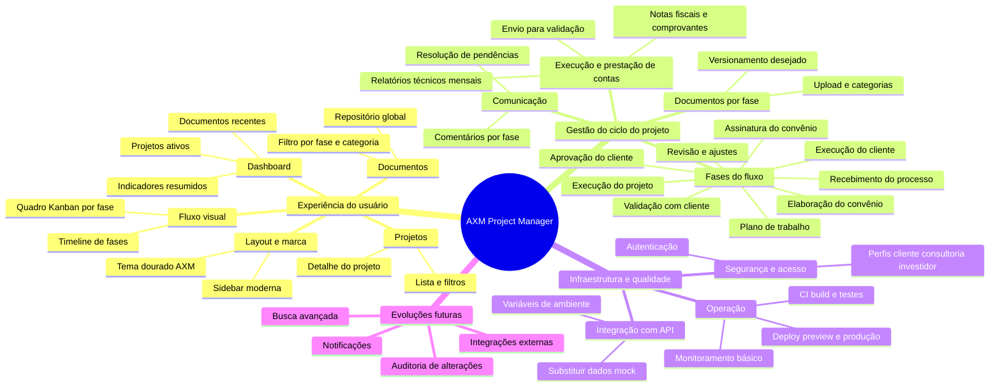

# Mapa mental — funcionalidades AXM Project Manager

Documento de referência para o escopo de produto: repositório de documentos (estilo drive) + fluxo de gestão de projetos com fases contratuais e acompanhamento.

---

## Diagrama (Mermaid)

> Em editores que suportam Mermaid (GitHub, GitLab, VS Code com extensão), o diagrama abaixo renderiza como mapa mental.

---

## Mapa em lista (mesma hierarquia)

### AXM Project Manager (raiz)

#### Experiência do usuário

- **Layout e marca** — Sidebar, identidade visual, navegação principal.
- **Dashboard** — Indicadores, projetos ativos, atalhos a documentos recentes.
- **Projetos** — Listagem com busca e filtros; tela de detalhe com abas.
- **Documentos** — Visão global do repositório com filtros.
- **Fluxo visual** — Timeline das fases; quadro estilo Kanban por coluna de fase.

#### Gestão do ciclo do projeto

- **Fases do fluxo** — Nove etapas desde recebimento até validação com o cliente.
- **Documentos por fase** — Anexos alinhados à etapa (plano, convênio, NF, relatório etc.).
- **Comunicação** — Comentários e ajustes vinculados à fase.
- **Execução e prestação de contas** — Relatórios mensais, NFs, fluxo de validação.

#### Infraestrutura e qualidade

- **Integração com API** — Backend real, persistência, cliente HTTP.
- **Segurança e acesso** — Login e permissões por papel.
- **Operação** — CI/CD, ambientes, documentação de execução.

#### Evoluções futuras

- Notificações, busca avançada, auditoria, integrações.

---

## Legenda de prioridade (sugestão)

| Área              | Curto prazo típico        | Médio prazo              |
|-------------------|---------------------------|--------------------------|
| UX / Visual       | Fluxo no menu, empty states | Refinos de acessibilidade |
| Ciclo do projeto  | Avanço de fase persistido | Regras por perfil        |
| Infra             | CI + preview deploy       | API + banco + storage    |

---

---

## Roadmap operacional

Cronograma por dias, back-end MVP, Docker/Render e checklist P0–P3:

→ **[ROADMAP-ENTREGAS.md](./ROADMAP-ENTREGAS.md)**  
→ **[DEPLOY-PRODUCAO.md](./DEPLOY-PRODUCAO.md)** — roteiro para colocar em produção

*Última atualização: documento gerado para alinhamento de escopo com cliente e time.*
